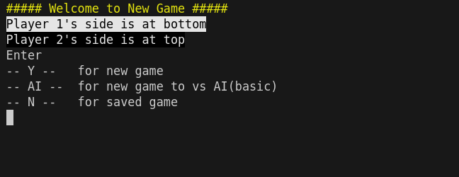
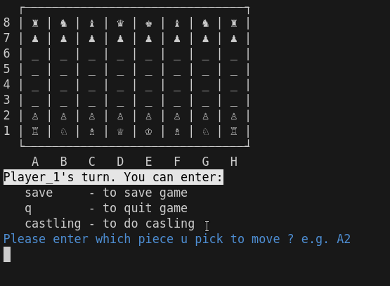

# Chess game (Command window)
This is a chess game, built with ruby and rspec.
It uses command window as UI. Include basic AI to make legal random move. This is part of projects built along curriculum at [The Odin Project](https://www.theodinproject.com/lessons/ruby-ruby-final-project).

## Features
- Use of OOP in ruby
- Use of modular test with rspec
- Save / Load the last game with YAML

## Installation
### Prerequisite:
- install ruby
- install ruby environment / ruby gem / bundle

1. git clone git@github.com:WongYC-66/odin-ruby-final-project.git
2. cd odin-ruby-final-project/
3. bundle install
4. bundle exec ruby main.rb / main.rb

- optional test:  rspec

## Future work
Make AI smarter with DSA, e.g. backtracking / knuth algo to maximize the win rate.

AI difficulty